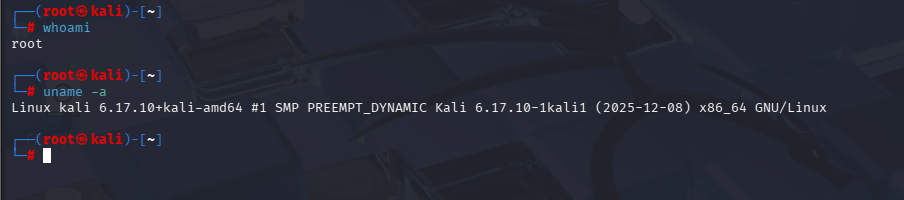
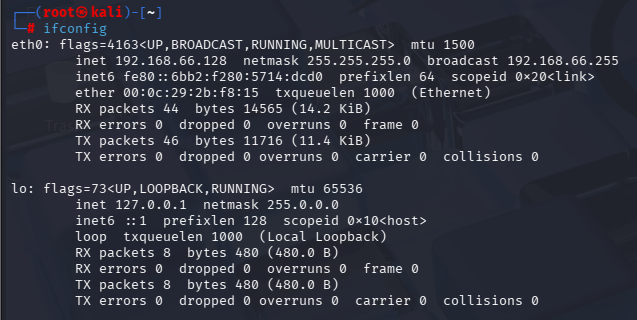
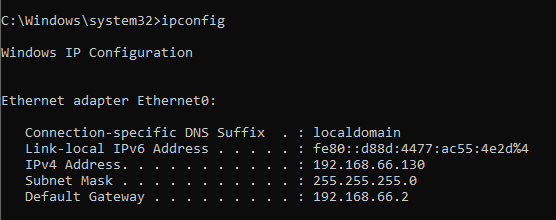
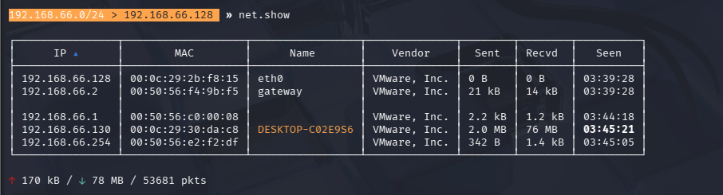
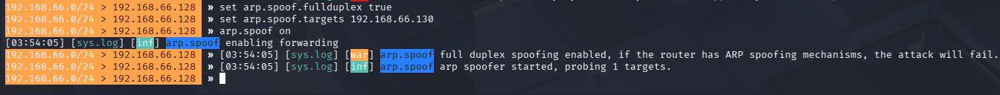

# Bettercap Network Assessment Lab

This repository documents a hands-on lab using Bettercap to understand how man-in-the-middle (MITM) attacks work on a local network. The goal of this project was to gain practical experience with network reconnaissance, traffic interception, and responsible cleanup, strictly for educational purposes.

---

## ⚠️ Disclaimer
This lab was conducted in a controlled environment on devices I own and have explicit permission to test. The content in this repository is intended for educational and learning purposes only.

---

## Environment
- Operating System: Kali Linux
- Tool Used: Bettercap
- Network Type: Local test network

---

## Network Interface Identification
Before launching Bettercap, the active wireless network interface was identified to ensure the tool was bound to the correct adapter.

 

---

## Bettercap Launch
Bettercap was started with elevated privileges and configured to use the selected wireless interface.

---

## Network Reconnaissance
Network probing and reconnaissance modules were enabled to discover active devices on the local network. This step allowed visibility into connected hosts and their basic details.

---

## Target Identification
The discovered hosts were reviewed to identify a suitable target for testing man-in-the-middle capabilities.

---

## Man-in-the-Middle Setup
ARP spoofing was configured to position the attacker between the target device and the network gateway, enabling traffic interception.

---

## Traffic Interception
Traffic sniffing modules were enabled to observe network communication passing through the attacker machine.

---

## Intercepted Traffic Evidence
Captured traffic confirms successful interception during the MITM attack, demonstrating the risks present on unsecured or poorly monitored networks.

---

## Cleanup
All active Bettercap modules were disabled and the session was terminated to restore the network to its original state.

---

## What I Learned
This lab improved my understanding of how MITM attacks operate in real-world scenarios, the importance of encrypted communication, and why proper network security controls are critical.

---

## Tools Used
- Bettercap
- Kali Linux
- Linux networking utilities

---

## signed 
jobstaar
